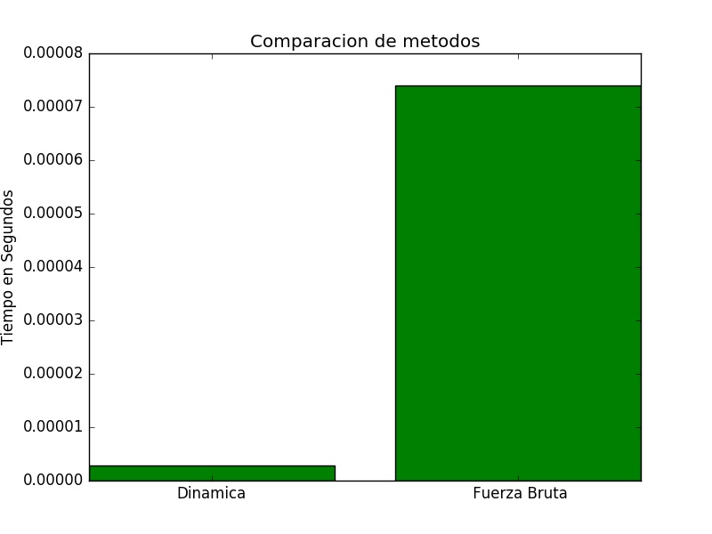

# Comparación entre Programación Dinámica y Fuerza Bruta

### Problema de la Mina

El problema de la mina puede resolverse de manera dinamica utilizando una matriz para guardar los resultados anteriores en el proceso.

La complejidad temporal resolviendo el problema por fuerza bruta es de O(n*3^n).

La complejidad temporal resolviendo el problema utilizando programacion dinámica es O(n*n*m) = O(n^2*m)

Al comparar ambos algoritmos, se nota una gran diferencia entre mayor sea el tamaño de la matriz, especial mente cuanto más cresca m, más va a tardar el algoritmo de fuerza bruta en terminar.


### Problema Mochila

La complejidad temporal de la mochila por fuerza bruta es de de O(2^n)

La complejidad temporal de la mochila por programacion dinamica es de O(n^2)

En el caso del problema de la mochila, se ejecuta con:
```
$ python3 mochila.py [archivo de salida(opcional)] [archivo con el problema]
```
Ejemplo de ejecucion



Como es visible en la figura 1, hay una diferencia significativa en los tiempos de cada corrida. La variante de dinamica tiene la ventaja que no vuelve a recalcular los resultados intermedios ya obtenidos, sino que los guarda y despues solo accesa a ellos.
A diferencia de backtracking, que en este metodo se recorren todas las posibles opciones pero si recalcula todos los resultados aunque sean repetidos y ya lo haya hecho en algun momento de la corrida.
